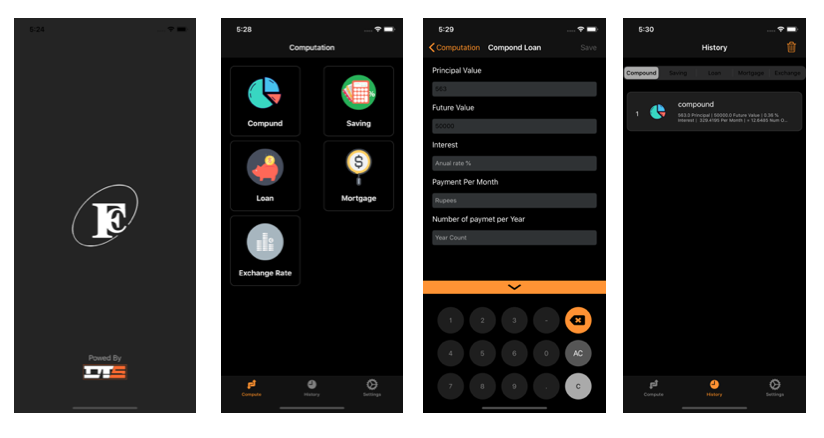

# FinancialApp
This is a financial app for the iPhone . The app shall have the capability of undertaking typical financial calculations such as savings, loans, and mortgages. 

    
    <h1 align="center">Financial Compute  App</h1>
    
A conceptual implementation of a Financial Compute  App for the iPhone.

#Screen

# Built With

&nbsp;&nbsp;

# License

This project is licensed under the MIT License - see the [LICENSE.md](LICENSE.md) file for details.
